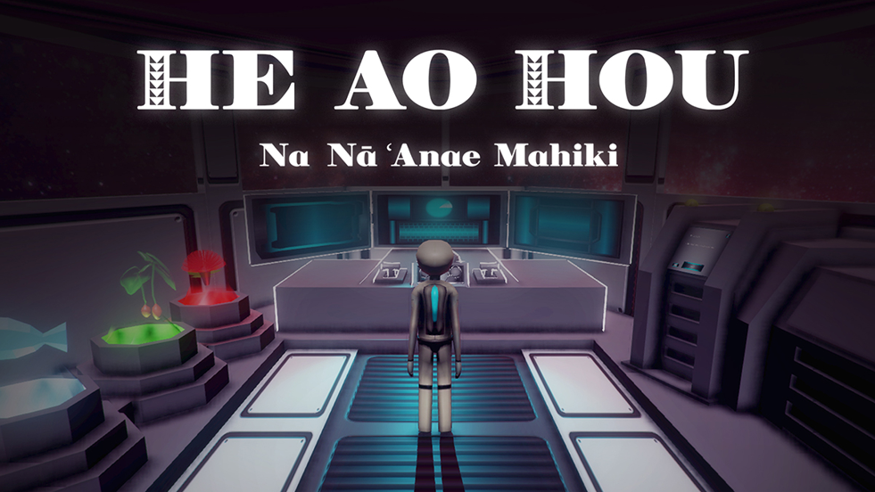
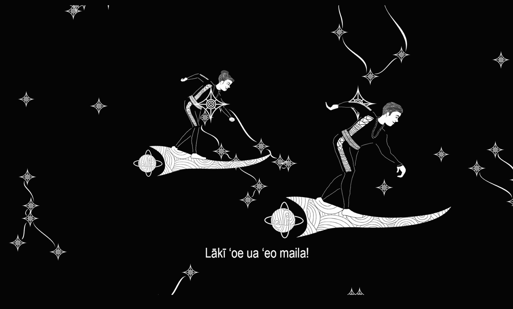
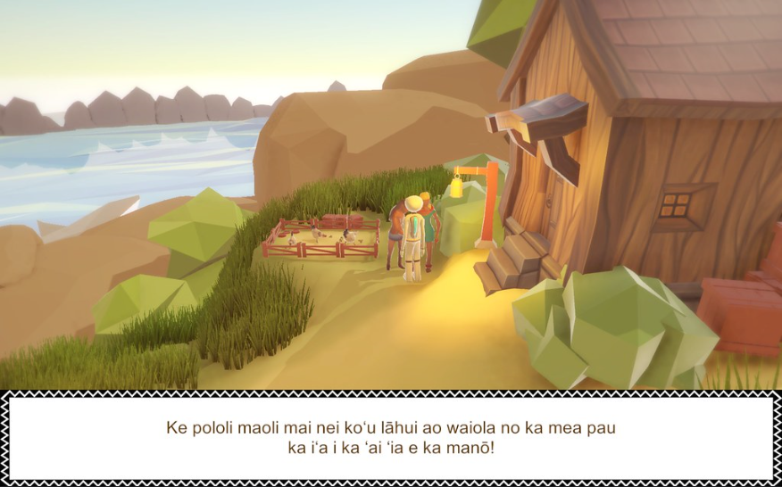

  
  
  

He Au Hou is a project of the Initiative for Indigenous Futures (IIF) Na 'Anae Mahiki, a collaboration of Kamehameha Schools, Concordia University of Montreal, and fifteen chosen participants from all across Hawai'i. Within a three-week period, our team were responsible for coming up with and creating a game with a focus on Hawaiian culture/storytelling. Along with brainstorming ideas, finalizing a theme/story, and creating the game, we also had to learn the software required, which included a 3D creation suite (Blender), game engine (Unity), audio editor (Audacity), and image editor (Adobe CC).

Our final product, He Au Hou, is a 3D adventure game that focuses on storytelling and star navigation, two fundamental aspects of Hawaiian culture. In the game, you play as a space pilot trying to find your sister, lost in space. Along the way, you encounter Hawaiian gods and dieties and have to solve their puzzles. While solving the puzzles, you learn more about the ancient legends of Pele and Hi'iaka, Kanaloa, and Kamapua'a.

For this project, I was on the 3D art team, who was responsible for creating concept art, critiquing and dicussing final concepts, modeling, texturing, rigging, and animating game models. This task was very labor-intensive, considering both the time it took to create a quality model, and the amount of models that needed to be created. One of my tasks included a representation of Kamapua'a, a pig demigod. The final model included a walk, idle, and enrage animation. I also had to work with the programming team to make sure everything worked properly and fit within their code.

  

You can learn more at the [Skins 5.0 Website](http://skins.abtec.org/skins5.0/).
You can download the game [here](http://skins.abtec.org/skins5.0/game-download/).

