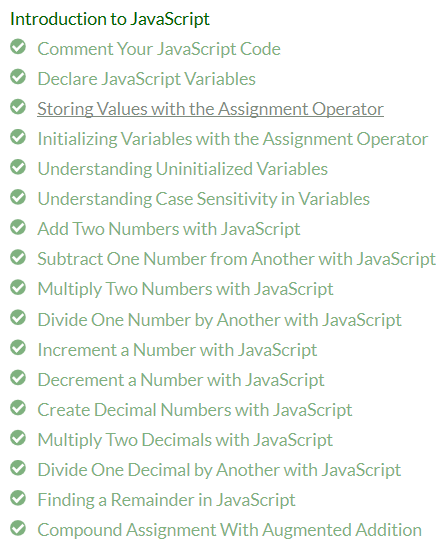

In my ICS 314 class, one of our assignments was to practice our Javascript coding skills using the FreeCodeCamp website. At first, the task seemed daunting. The site said it would take 10 hours to finish the basics course! However, it only took a couple hours to complete both the basics and ES6 course. The purpose of this assignment was to prepare us for the projects we will be doing in class.
