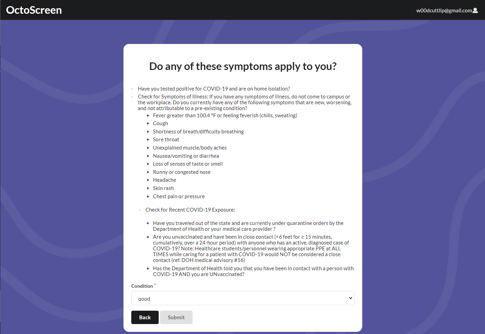
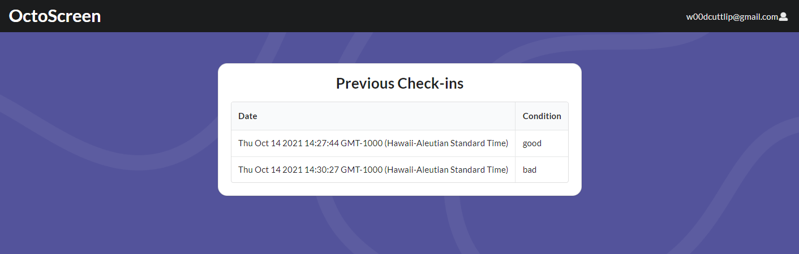
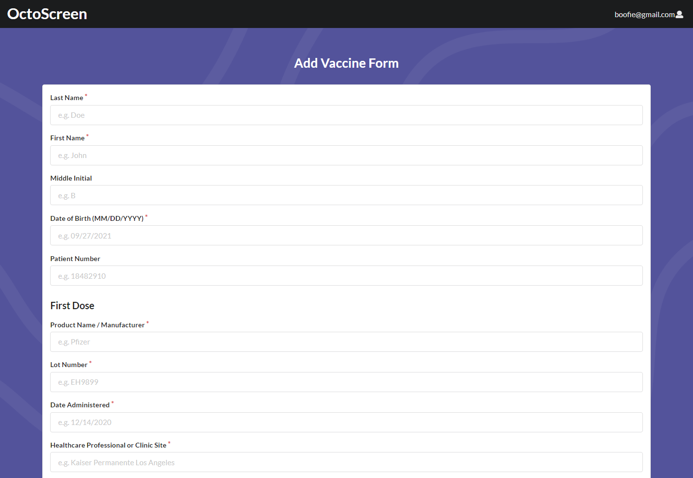
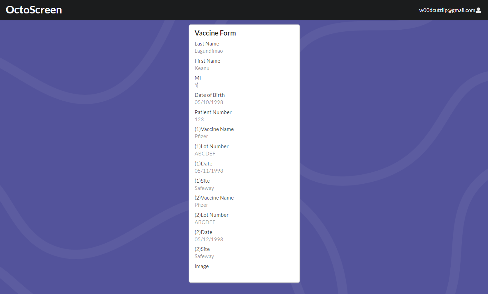

---
layout: project
type: project
image: images/StudyMatchsLogoWithDescription.PNG
title: Octo Screen
permalink: projects/octoscreen
# All dates must be YYYY-MM-DD format!
date: 2021-10-14
labels:
  - JavaScript
  - HTML
  - CSS
  - React
  - Semantic UI
  - Meteor
  - Web Development
summary: A web app that helps people monitor their COVID-19 status
--- 

<h1>Octo-Screen</h1>

<h1>What is Octo-Screen?</h1>

OctoScreen is an online tool that allows users to keep track of their COVID-19 status through a check-in based system. Users can log in, check in by taking the sympmtoms questionaire, and then view their status along with all their previous check-ins. In addition, users can upload and view their vaccination card information, along with a picture of their vaccination card.

<h1>Links</h1>

[Deployment](octo-screen.meteorapp.com)
[Github](https://github.com/ics491-kkj/octo-screen)

<h1>Check-In</h1>

<h1>Status</h1>

<h1>Submit Vaccination Card</h1>

<h1>Vaccination Status</h1>

This project reminded me of how important skills such as communication and teamwork are. Throughout the project I mainly worked on the Vaccination Status page. 

My experience working on this project with my team members was definitely a learning experience, as I learned a lot from my shortcomings in this project. One of the main issues I personally faced was coordinating with the rest of my group members, as I often found our work overlapping with each other. This in addition to failing to effectively communicate with my team members resulted in me scrapping a lot of my contributions because they were already implemented. I look to improve on these aspects going into the next projects with my team.