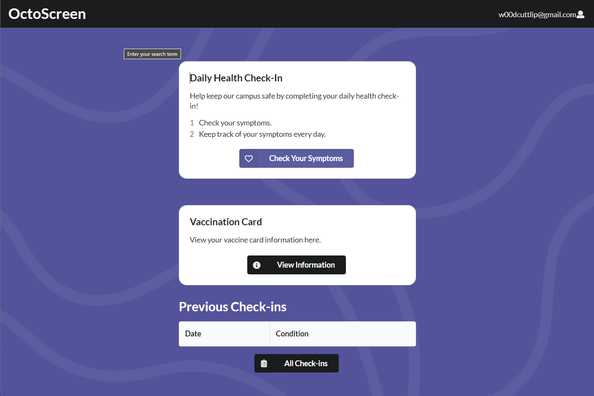

---
layout: project
type: project
image: images/StudyMatchsLogoWithDescription.PNG
title: Octo Screen
permalink: projects/octoscreen
# All dates must be YYYY-MM-DD format!
date: 2021-10-14
labels:
  - JavaScript
  - HTML
  - CSS
  - React
  - Semantic UI
  - Meteor
  - Web Development
summary: 
--- A web app that helps people monitor their COVID-19 status

<h1>Octo-Screen</h1>

<h1>What is Octo-Screen?</h1>

OctoScreen is an online tool that allows users to keep track of their COVID-19 status through a check-in based system. Users can log in, check in by taking the sympmtoms questionaire, and then view their status along with all their previous check-ins. In addition, users can upload and view their vaccination card information, along with a picture of their vaccination card.

<h1>Links</h1>

[Deployment](octo-screen.meteorapp.com)
[Github](https://github.com/ics491-kkj/octo-screen)

Our goal for this project was to create a website where users could be able to form study groups, kind of like a social media platform. 
We wanted it to be easy for users to match with other users with the same interests as them, and also to come together as a group. We intended to achieve these goals by having an event system: A user would create an event, and other users would be able to sign up for that event. 

My role was creating the schedule page, a page where the user could find events, called "study sessions". Study session organizers would be able to create/edit events, and users would be able to sign up for events using this page.

This experience has taught me a lot about working with UI frameworks, specifically React's integrated Semantic UI. I learned a lot, mainly how to create components and design them to do it's intended purpose. My takeaway from this is that there can be so many possible ways to implement an element into a project, and none of them would be wrong. However, if something isn't done consistently, it can be confusing for others who are also working on the same thing.

To learn more, here's the [link to our organization page.](https://studymatchs.github.io/)
